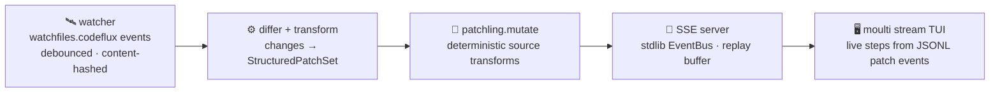

<div align="right">

[](https://github.com/toxicwind/codeflux)
[](https://www.python.org/)
[](https://github.com/toxicwind/codeflux)
[](https://github.com/toxicwind/codeflux)

</div>

# codeflux

### Watch code. Emit patches. Stream everything.

**codeflux** is a live, code-forward streaming system: a continuously operating pipeline that watches a code tree, transforms changes into **structured patches**, and streams them live — over SSE and into a TUI. If your codebase is a river, codeflux is the telemetry buoy floating on it: every change becomes an event, every event becomes data, every byte is watchable in real time.

Built for people who run living codebases — agent fleets, CI systems, demo harnesses — and want to *see* code change as it happens instead of diffing it after the fact.

---

## ✨ Features

- **Live file watcher** — Rust-powered file events via the codeflux-watchfiles fork, with a stdlib mtime poller fallback so the pipeline runs anywhere
- **Structured patch events** — changes become hunks-as-data (debounced, content-hashed), not raw text
- **Zero-dependency SSE server** — `EventBus` + `ThreadingHTTPServer`, pure stdlib, with a replay buffer and snapshot endpoint
- **Live TUI streaming** — patch events rendered as they land via the `moulti stream` subcommand
- **Deterministic demo mode** — synthetic code updates streamed end-to-end with a readiness canary, reproducible on every run
- **Fork-powered stages** — every pipeline stage is backed by a real fork in `forks/`, each pushed to its own repo

---

## 🏗️ The pipeline



| Stage | Module | Fork powering it |
|---|---|---|
| file watcher / live-reload | `codeflux/watcher.py` | [`codeflux-watchfiles`](https://github.com/toxicwind/codeflux-watchfiles) — `watchfiles.codeflux` structured events (debounced, content-hashed, JSONL) |
| TUI streaming diffs/logs | `codeflux/tui.py` | [`codeflux-moulti`](https://github.com/toxicwind/codeflux-moulti) — `moulti stream` ingests JSONL patch events into live steps |
| patch parse/apply | `codeflux/differ.py`, `codeflux/transform.py` | [`codeflux-python-patch`](https://github.com/toxicwind/codeflux-python-patch) — `StructuredPatchSet` (hunks-as-data, `apply_report`) |
| code transformation | `codeflux/demo.py` | [`codeflux-patchling`](https://github.com/toxicwind/codeflux-patchling) — offline deterministic `patchling.mutate` backend (no LLM, no key) |

---

## 🚀 Quick start

```bash
# demo: synthetic code updates streamed end-to-end (watcher → diff → SSE)
python -m codeflux demo --events 10 --port 8765

# continuously operating mode: watch a real tree, serve patch events
python -m codeflux serve --watch /path/to/tree --port 8765

# render the live stream in the moulti TUI (needs a terminal)
moulti init
python -m codeflux tui --port 8765
```

**Endpoints:** `GET /health` · `GET /snapshot` (replay buffer) · `GET /events` (SSE)

---

## 🔧 Architecture

```
codeflux/
├── watcher.py     # file watching (Rust events or stdlib mtime poller)
├── differ.py      # change → StructuredPatchSet
├── transform.py   # patch transformations
├── events.py      # structured patch-event model
├── server.py      # stdlib-only SSE server (EventBus + ThreadingHTTPServer)
├── demo.py        # deterministic synthetic update generator
├── tui.py         # moulti TUI streaming client
└── cli.py         # demo / serve / tui subcommands
```

`server.py` has **no dependencies** — the whole SSE layer is stdlib. The watcher prefers the Rust extension from the watchfiles fork and falls back to a stdlib mtime poller, so the pipeline runs anywhere Python 3.10+ runs.

### Forks

Each fork lives in `forks/<name>/` as a plain directory with its own `.git` (not submodules), pushed to its own repo — see `forks/README.md`.

### 🗺️ Improvement backlog

- [ ] `codeflux serve` as a pitchfork service watching the sovereign tree
- [ ] websocket transport alongside SSE (bidirectional control: pause/replay)
- [ ] moulti `stream --as-diff` rendering diffs with delta colors
- [ ] watchfiles: build + publish the Rust extension in CI for the fork
- [ ] patchling.mutate: more rules (extract function, reorder imports, type-annotate)
- [ ] event persistence: append patch events to a local parquet log for replay
- [ ] auth/token on the SSE endpoint for non-localhost exposure
- [ ] watchfiles `watch_events`: readiness signal (baseline taken) so consumers don't need the demo's canary-file handshake
- [x] demo determinism — readiness canary fixes the watcher-baseline race; per-step watcher handshake prevents rapid-write coalescing; SSE delivered-drain before shutdown; verifier parses `DEMO_RESULT` and breaks on stream EOF

---

## ⚙️ Config

| Flag | Default | Purpose |
|---|---|---|
| `--events` | — | number of synthetic events in `demo` mode |
| `--port` | `8765` | port for the SSE server and TUI client |
| `--watch` | — | tree to watch in `serve` mode |

No API keys, no accounts, no network services required. The demo and offline paths are fully self-contained.

---

## 🛠️ Dev

```bash
bash build_venv.sh     # build the dev venv
python smoke1.py       # smoke test
python smoke2.py       # second smoke pass
pytest tests/          # full test suite
python verify_live.py  # live end-to-end verification
```

Contributions welcome — open an issue or PR on [toxicwind/codeflux](https://github.com/toxicwind/codeflux). Keep the pipeline stages fork-backed: new capabilities land in the satellite forks first.

---

## 🧬 The codeflux family

| Repo | Role |
|---|---|
| [**codeflux**](https://github.com/toxicwind/codeflux) | the live streaming pipeline (this repo) |
| [**codeflux-moulti**](https://github.com/toxicwind/codeflux-moulti) | TUI steps + `stream` subcommand |
| [**codeflux-patchling**](https://github.com/toxicwind/codeflux-patchling) | deterministic mutation backend |
| [**codeflux-python-patch**](https://github.com/toxicwind/codeflux-python-patch) | hunks-as-data + apply reports |
| [**codeflux-watchfiles**](https://github.com/toxicwind/codeflux-watchfiles) | structured file events |
| [**ast-grep**](https://github.com/toxicwind/ast-grep) | structural search satellite (toxicwind fork) |
| [**agent-dashboard**](https://github.com/toxicwind/agent-dashboard) | fleet UI (toxicwind Next.js fork) |

Upstream inspirations: [moulti](https://github.com/xavierog/moulti) · [patchling](https://github.com/255BITS/patchling-py) · [python-patch](https://github.com/techtonik/python-patch) · [watchfiles](https://github.com/samuelcolvin/watchfiles) · [ast-grep](https://github.com/ast-grep/ast-grep)

---

## 📄 License & security

**License:** no license file is declared in this repo yet — treat as all rights reserved unless one is added. If you need one, open an issue.

**Security:** this pipeline is designed for localhost. Do not expose the SSE endpoint to a network without adding auth (see backlog). Report vulnerabilities privately via GitHub Security Advisories on this repo — never in a public issue.
